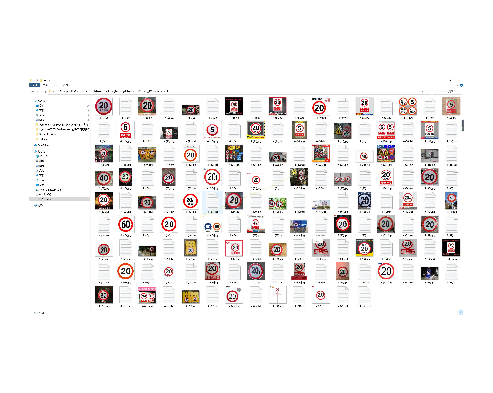

# 1.图片演示：


# 2.视频演示：

[[项目分享]Python基于YOLOv5的交通标志识别系统[源码＆技术文档＆部署视频＆数据集]_哔哩哔哩_bilibili](https://www.bilibili.com/video/BV1Gg411Q7jU/?vd_source=bc9aec86d164b67a7004b996143742dc)

# 3.标注好的数据集：





# 4.YOLO网络的构建：

网络结构是首先用Focus将计算图长宽变为原先1/4， channel 数量乘4。再用bottlenectCSP 提取特征，个人理解 CSP 就是更多不同channel的融合吧。

然后再用maxpooling 下采样构建特征金字塔。下采样过每阶段与input cancatenate。 

再对下采样产生的feature map 上采样，与backbone里相应的层融合。最后用detect层预测anchors。detect 层输出channel是 （class num + 5）* 每层每grid预测的anchor 数。num class是预测结果为每类的概率，5是anchor的 x, y, w, h 和是否为object的置信度。默认配置经过maxpooling 以后产生三个尺寸的feature map，每个feature map 经过上采样融合等操作后都会用来预测anchor，每个grid 预测三个anchor。比如yolov5 s 预测anchor 有80类。输出 x.shape=(bs, 3, 20, 20, 85)。
# 5.数据增强：
在深度学习领域，对于数据量的要求是巨大的，在CV领域，我们通过图像数据增强对现有图像数据进行处理来丰富图像训练集，这样可以有效的泛化模型，解决过拟合的问题。

[该博客提出的图像数据增强方式](https://mbd.pub/o/bread/Yp6clZtx)有旋转图像、裁剪图像、水平或垂直翻转图像，改变图像亮度等，为了方便训练模型，我们通常会对数据进行归一化或者标准化以及将图片大小设置为一样。


# 6.代码实现：
[该博客代码写法上来值得注意](https://afdian.net/item?plan_id=c673a3305e4f11ed83be52540025c377)的有这几处：

1 首先有 focus 层，对输入图片slice, 把feature map减小增加channel 后面计算速度会快。

2 构建模型(parse_model) 在yolo.py 里面，用一个数组(ch) 存储了每层的输出channel, 后续concatenate的时候很容易构成concatenate后输出的channel 数量。

3 对除了最后一层预测层外，每层output channel都检查是不是8的倍数，保证后续concate的时候不会出问题

4 common.py 里面是各种basic block, 除了bottlenect, CSP, concate层等，还有transformer 等层。 

首先导入相关模块：
```
import tensorflow as tf
import numpy as np
import pandas as pd 
import cv2
import matplotlib.pyplot as plt
import os
from sklearn.model_selection import train_test_split
```
读取图片：target.txt的内容如下所示，前面对应图片名字，后面对应图片的类别
```
x=[]
y=[]
with open ('./target.txt','r') as f:
    for j,i in enumerate(f):
        path=i.split()[0]
        lable=i.split()[1]
        print('读取第%d个图片'%j,path,lable)
        src=cv2.imread('./suju/'+path)
        x.append(src)
        y.append(int(lable))

```
将数据归一化，并且划训练集和验证集
```
x=np.array(x)
y=np.array(y)
x.shape,y.shape
y=y[:,None]
x_train,x_test,y_train,y_test=train_test_split(x,y,stratify=y,random_state=0)
#归一化
x_train=x_train.astype('float32')/255
x_test=x_test.astype('float32')/255

y_train_onehot=tf.keras.utils.to_categorical(y_train)
y_test_onehot=tf.keras.utils.to_categorical(y_test)

```
搭建网络模型
```
model=tf.keras.Sequential([
    tf.keras.Input(shape=(80,80,3)),
    tf.keras.layers.Conv2D(filters=32,kernel_size=(3,3),padding='same',activation='relu'),
    tf.keras.layers.MaxPooling2D(pool_size=(2,2),strides=(2,2)),
    tf.keras.layers.Conv2D(filters=64,kernel_size=(3,3),padding='same',activation='relu'),
    tf.keras.layers.MaxPooling2D(pool_size=(2,2),strides=(2,2)),
    tf.keras.layers.Conv2D(filters=32,kernel_size=(3,3),padding='same',activation='relu'),
    tf.keras.layers.MaxPooling2D(pool_size=(2,2),strides=(2,2)),
    tf.keras.layers.Flatten(),
    tf.keras.layers.Dense(1000,activation='relu'),
    tf.keras.layers.Dropout(rate=0.5),
    tf.keras.layers.Dense(43,activation='softmax')
])
model.compile(
    loss='categorical_crossentropy',
    optimizer='adam',
    metrics=['accuracy']
)
train_history=model.fit(x_train,y_train_onehot,batch_size=100,epochs=8,validation_split=0.2,verbose=1,
          )

```
画图显示模型的loss和acc
```
la=[str(i) for i in range(1,9)]
def show(a,b,c,d):
    
    
    fig,axes=plt.subplots(1,2,figsize=(10,4))
    axes[0].set_title('accuracy of train and valuation')
    axes[0].plot(la,train_history.history[a],marker='*')
    axes[0].plot(train_history.history[b],marker='*')
    axes[0].set_xlabel('epoch')
    axes[0].set_ylabel('accuracy')
    
    aa=round(train_history.history[a][7],2)
    bb=round(train_history.history[b][7],2)
    
    axes[0].text(la[7],train_history.history[a][7],aa,ha='center',va='bottom')
    axes[0].text(la[7],train_history.history[b][7],bb,ha='center',va='top')
    #axes[0].set_xticks(la,['as','asd',3,4,5,6,7,8])
#     for x1,y1 in zip(la,train_history.history[a]):
#         y1=round(y1,2)
#         axes[0].text(x1,y1,y1,ha='center',va='bottom',fontsize=10,c='b')
        
    axes[0].legend(['train_accuracy','val_accuracy'])
    
    axes[1].set_title('loss of train and valuation')
    axes[1].plot(la,train_history.history[c],marker='*')
    axes[1].plot(train_history.history[d],marker='*')
    axes[1].set_xlabel('epoch')
    axes[1].set_ylabel('loss')
    
    cc=round(train_history.history[c][7],2)
    dd=round(train_history.history[d][7],2)
    
    axes[1].text(la[7],train_history.history[c][7],cc,ha='center',va='top')
    axes[1].text(la[7],train_history.history[d][7],dd,ha='center',va='bottom')
    axes[1].legend(['train_loss', 'val_loss'])
    #axes[1].show()

show('accuracy','val_accuracy','loss','val_loss')
```
保存模型
```
model.save('traffic_model2.h5')
```
# 7.训练结果：


完整[源码&环境部署视频教程&数据集&自定义训练视频教程](https://s.xiaocichang.com/s/caf5a2)
参考博客[《Python基于YOLOv5的交通标志识别系统\[源码＆技术文档＆部署视频＆数据集\]》](https://mbd.pub/o/qunma/work)

# 8.参考文献：
【1】谢豆,石景文,刘文军,刘澍.[一种基于深度学习的交通标志识别算法研究[J]](http://yuxiqbs.cqvip.com/Qikan/Article/Detail?id=7106892593&from=Qikan_Article_Detail).电脑知识与技术:学术版,2022,18(6):116-118.
【2】王泽华,宋卫虎,吴建华.[基于改进YOLOv4网络的轻量化交通标志检测模型[J]](http://yuxiqbs.cqvip.com/Qikan/Article/Detail?id=7106890735&from=Qikan_Article_Detail).电脑知识与技术:学术版,2022,18(5):98-101.


---
#### 如果您需要更详细的【源码和环境部署教程】，除了通过【系统整合】小节的链接获取之外，还可以通过邮箱以下途径获取:
#### 1.请先在GitHub上为该项目点赞（Star），编辑一封邮件，附上点赞的截图、项目的中文描述概述（About）以及您的用途需求，发送到我们的邮箱
#### sharecode@yeah.net
#### 2.我们收到邮件后会定期根据邮件的接收顺序将【完整源码和环境部署教程】发送到您的邮箱。
#### 【免责声明】本文来源于用户投稿，如果侵犯任何第三方的合法权益，可通过邮箱联系删除。